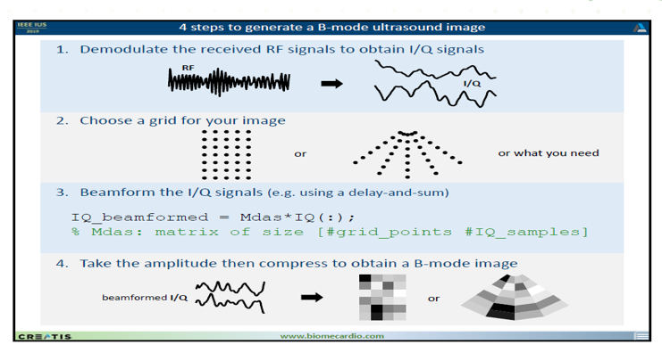
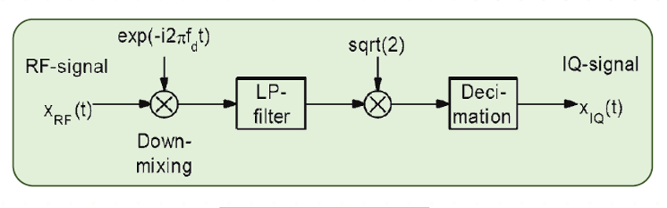
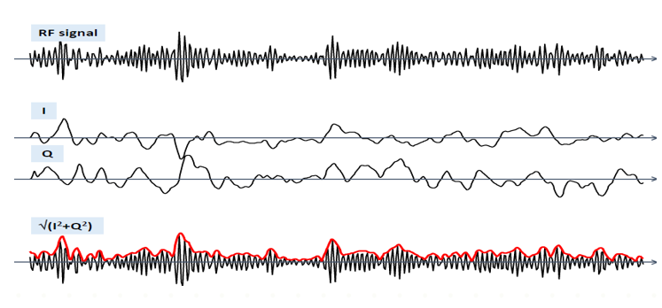
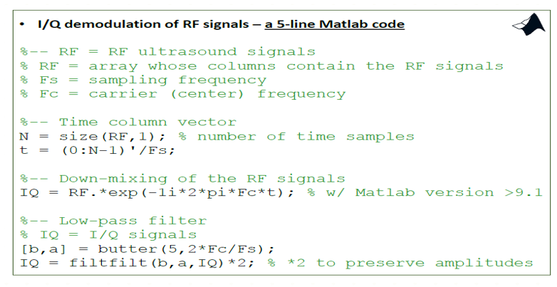

# echocardiography-RF-to-B-mode-
# This project has not been fineshed
## After acquiring RF signal from probes we must apply some processes to obtain a 2D image

there are 4 steps :

    1- converting RF to I/Q
    2- choose a gfid mesh
    3- beamforming the I/Q signals
    4- take the amplitude and comprees it by logarithm function to construct a image

### 1- converting RF to I/Q
 
 
  
  
  
 
 
 
 ### matlab code
 
 
  
 
 
 ### 2- choose a grid mesh

 
 
 
 
 
 
 
 ### 3- beamforming the I/Q signals

 
 
 
 
 
 ### 4- take the amplitude and comprees it by logarithm function to construct a image

 
